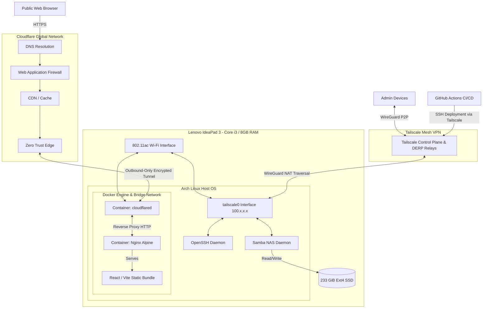

<div align="center">


# arch-server

**Headless Arch Linux Implementation for Network Attached Storage, Edge Computing, and Zero-Trust Web Hosting on Repurposed Hardware**

[](https://archlinux.org/)
[](https://www.docker.com/)
[](https://www.cloudflare.com/)
[](https://tailscale.com/)
[](https://github.com/features/actions)

</div>

> **[LIVE DEMO: arch-server.tanmaytiwari.me](https://arch-server.tanmaytiwari.me)**: The website for this repository is currently being served directly from the physical hardware documented below. *(Note: GitHub blocks `target="_blank"` for security, so middle-click or Cmd/Ctrl+Click to open in a new tab!)*

---

## Architectural Overview

This repository documents the system architecture, configuration, and CI/CD deployment strategy for a headless Arch Linux server deployed on a repurposed Lenovo IdeaPad. 

The system functions as a highly secure, zero-trust edge server. It hosts a globally accessible production React website via **Cloudflare Tunnels**, automated via **GitHub Actions**, while securely operating as a local Network Attached Storage (NAS) node strictly within a **Tailscale** mesh network.



---

## Repository Structure

```text
arch-server/
├── assets/                     # Static media and documentation assets
│   └── fastfetch.png
├── website/                    # React frontend application
│   ├── src/                    # UI components and pages
│   ├── public/                 # Static web assets (favicon, robots.txt)
│   ├── Dockerfile              # Container build instructions for frontend
│   └── package.json            # Node.js dependencies
├── .github/workflows/          # CI/CD pipeline definitions
│   └── deploy.yml              # Automated Zero-Trust deployment script
├── docker-compose.yml          # Root orchestration for all homelab services
├── README.md                   # System documentation
└── .env                        # Environment variables (Ignored in Git)
```

---

## The Web Infrastructure (Zero-Trust)

The server hosts a high-performance React frontend (`/website`) served by Nginx. The infrastructure is designed with enterprise-grade security principles, completely isolating the physical home network from the public internet.

### 1. Zero-Trust Routing (Cloudflare Tunnels)
Instead of relying on dangerous local port forwarding or exposing the home IP address, public web traffic is routed through **Cloudflare Zero Trust Tunnels**.
- **No Open Ports:** The physical router has exactly zero open ports.
- **Outbound Only:** The `cloudflared` Docker container establishes a secure, outbound-only connection to Cloudflare's edge servers.
- **Automatic SSL:** Cloudflare automatically provisions and enforces strict SSL/HTTPS at the edge without requiring local `certbot` management.

### 2. CI/CD Deployment Pipeline (GitHub Actions)
Deployments are 100% automated via GitHub Actions, establishing a secure tunnel into the local network without exposing SSH to the internet.
- On every push to `main`, a GitHub Action runner boots up.
- The runner connects to the Lenovo server securely via **SSH over Tailscale**.
- It pulls the latest code, injects the Cloudflare Tunnel Token, and completely rebuilds the Docker containers (`docker compose up -d --build`).

### 3. Hardened Docker Containers
The application runs in isolated, optimized Docker containers:
- **Node.js 22 & Nginx Alpine:** Multi-stage builds are used to compile the React/Vite application into static files, served by a lightweight Nginx container.
- **Resource Limits:** Hard caps on RAM (512MB) and CPU cores prevent memory leaks from freezing the host server.
- **Privilege Stripping:** Containers run with `no-new-privileges: true` to prevent any potential kernel privilege escalation.

---

## Hardware Specifications

| Subsystem | Specification |
|-----------|---------------|
| **Chassis/Model** | Lenovo IdeaPad 3 15IML05 |
| **Processor** | Intel Core i3-10110U (4 threads @ 4.10 GHz) |
| **Memory** | 8 GiB DDR4 |
| **Storage Topology** | 233 GiB Solid State Drive (ext4 filesystem) |
| **Graphics** | Intel UHD Graphics (Integrated) |
| **Network Interface** | 802.11ac Wi-Fi via NetworkManager |
| **Operating System** | Arch Linux x86_64 |

---

## Administrative Network & Remote Access

The server supports two remote access methods depending on the connecting device.

### Method 1: SSH over Tailscale (Trusted Devices)

For devices with Tailscale installed and authenticated. This is the default method used by the CI/CD pipeline.

- **NAT Traversal:** Seamless connectivity regardless of physical network location.
- **End-to-End Encryption:** All traffic secured via WireGuard tunnels.
- **Identity-Based Access:** Restricted to authenticated nodes within the Tailscale tenant.

```bash
ssh <username>@<tailscale-ip>
```

---

### Method 2: SSH over Cloudflare Access (Any Device, Anywhere)

For accessing the server from any machine without Tailscale — a work laptop, a phone, a public terminal. Routed through the existing `cloudflared` infrastructure with a mandatory identity verification layer.

**Security model (two factors required):**
- **Email OTP** — Cloudflare Access sends a one-time PIN to the owner's email before any connection is allowed.
- **SSH Private Key** — Cryptographic key on the connecting device is required after authentication.

**No open ports are exposed.** Traffic is routed through the same Cloudflare Zero Trust tunnel used by the website.

#### Client Setup (one-time per device)

1. Install `cloudflared`:
```bash
# macOS
brew install cloudflare/cloudflare/cloudflared

# Linux (Debian/Ubuntu)
sudo apt install cloudflared

# Windows
winget install Cloudflare.cloudflared
```

2. Add to `~/.ssh/config`:
```
Host ssh.tanmaytiwari.me
  ProxyCommand cloudflared access ssh --hostname %h
  User tanmay
  IdentityFile ~/.ssh/id_ed25519
  ServerAliveInterval 60
```

3. Connect from anywhere:
```bash
ssh ssh.tanmaytiwari.me
# First use: browser opens → enter email → enter OTP → shell
# Repeat within 8h session: instant connect
```

---

### Method 3: Browser-Based SSH (Zero Installs)

For situations where you cannot install any software — a library computer, a friend's phone, a school tablet. A full terminal is rendered directly inside a web browser tab.

**Security model:**
- **Email OTP** — Cloudflare Access gates access with a one-time PIN.
- **No client software required** — works on any device with a modern browser.

**How to use:**
1. Open **[https://ssh.tanmaytiwari.me](https://ssh.tanmaytiwari.me)** in any browser.
2. Cloudflare Access will prompt for your email address.
3. Enter the one-time PIN sent to that email.
4. A terminal emulator renders in the browser — enter your server username.
5. Full interactive shell session, no downloads needed.

#### Access Comparison

| | Tailscale SSH | Cloudflare Access SSH | Browser SSH |
|---|---|---|---|
| Requires Tailscale | YES | No | No |
| Works from any device | No | **YES** | **YES** |
| Requires client install | YES (Tailscale) | YES (cloudflared) | **No** |
| Zero open ports | YES | **YES** | **YES** |
| Auth mechanism | Device trust | OTP + SSH key | **OTP only** |
| Audit logs | No | **YES** | **YES** |

---

## Storage Subsystem: Samba NAS

The primary storage interface is implemented using the Server Message Block (SMB) protocol via Samba. This facilitates seamless cross-platform file operations across the private mesh network.

### Client Integration
| Client OS | Connection URI Protocol |
|-----------|-------------------------|
| **macOS** | `smb://<tailscale-ip>` |
| **Windows** | `\\<tailscale-ip>` |
| **iOS / iPadOS** | `smb://<tailscale-ip>` |

> **Security Definition:** The SMB daemon listens exclusively on the Tailscale virtual interface. It is completely inaccessible from the public internet.

---

## Terminal Utilities

### Network Management (`wlctl`)
Wireless network provisioning is managed via **wlctl**, an ncurses-based terminal user interface built for NetworkManager. It provides a robust administrative interface for SSID scanning and diagnostics over SSH.

### File System Navigation (`yazi`)
Terminal-based file operations are accelerated using **Yazi**, an asynchronous TUI file manager written in Rust, providing image previews and archive extraction directly within the SSH session.

### Automation Scripts (`~/scripts/`)
A suite of lightweight bash scripts is deployed for rapid system introspection over SSH:
- `battery.sh` - Power Telemetry
- `network-status.sh` - WLAN State
- `whatsong.sh` - Media State
- `whoami.sh` - Session Identity

---

## System Provisioning

The following sequences detail the required commands to bootstrap the core server environment from a minimal Arch Linux installation.

### 1. Docker & Docker Compose
```bash
sudo pacman -Sy docker docker-compose
sudo systemctl enable --now docker
sudo usermod -aG docker <username>
```

### 2. Secure Shell & Tailscale
```bash
sudo systemctl enable --now sshd
yay -S tailscale-bin
sudo systemctl enable --now tailscaled
sudo tailscale up
```

### 3. SMB Storage Deployment
```bash
sudo pacman -S samba
sudo smbpasswd -a <username>
sudo systemctl enable --now smb nmb
```

---

<div align="center">

*Engineered on Repurposed Hardware. Secured via Mesh Networking. Deployed via Edge Compute.*

</div>
