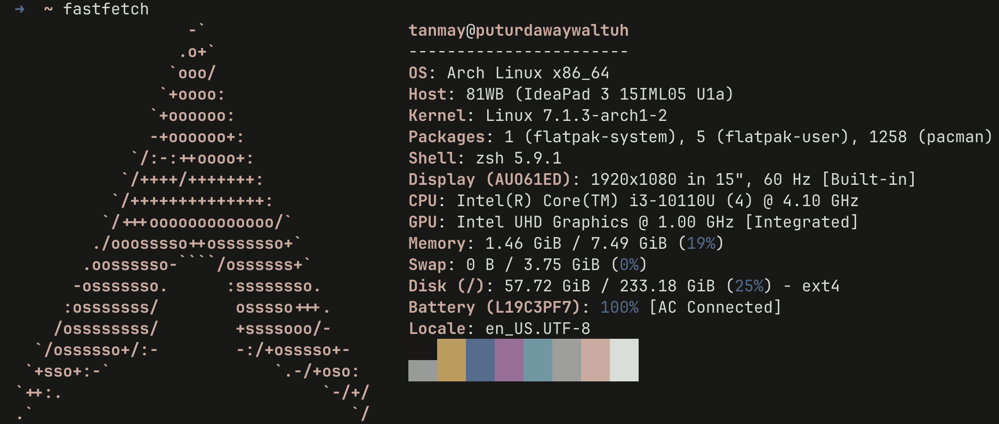

<div align="center">



# arch-server

**Headless Arch Linux Implementation for Network Attached Storage and Edge Computing on Repurposed Hardware**

[](https://archlinux.org/)
[](https://tailscale.com/)
[](https://www.samba.org/)
[](https://www.openssh.com/)

</div>

---

## Architectural Overview

This repository documents the system architecture, configuration, and deployment strategy for a headless Arch Linux server. Deployed on a repurposed Lenovo IdeaPad, the system functions primarily as a highly secure, globally accessible Network Attached Storage (NAS) node and development sandbox.

The underlying configuration preserves the original Hyprland graphical environment (documented in [hyprland-dotfiles](https://github.com/tanmayhutt/hyprland-dotfiles)) for potential future utilization, while currently operating strictly via secure shell over a zero-trust mesh network.

---

## Hardware Specifications

| Subsystem | Specification |
|-----------|---------------|
| **Chassis/Model** | Lenovo IdeaPad 3 15IML05 |
| **Processor** | Intel Core i3-10110U (4 threads @ 4.10 GHz) |
| **Memory** | 8 GiB DDR4 |
| **Storage Topology** | 233 GiB Solid State Drive (ext4 filesystem) |
| **Graphics** | Intel UHD Graphics (Integrated) |
| **Network Interface** | 802.11ac Wi-Fi via NetworkManager |
| **Operating System** | Arch Linux x86_64 |
| **Kernel Version** | Linux 7.1.3-arch1-2 |

---

## Network Topology & Remote Access

The server infrastructure relies on a zero-trust network architecture, strictly limiting access through a private Tailscale mesh network.

### SSH over Tailscale

Administrative access is brokered exclusively via **SSH over Tailscale**. This design provides several critical security and operational advantages:
- **Zero Ingress Ports**: Eliminates the requirement for local port forwarding on the perimeter firewall.
- **NAT Traversal**: Ensures seamless connectivity regardless of the host's physical network location.
- **End-to-End Encryption**: Secures all administrative traffic via WireGuard tunnels.
- **Identity-Based Access**: Restricts visibility and access to authenticated nodes within the designated Tailscale tenant.

```bash
ssh <username>@<your-tailscale-ip>
```

> **Note:** The server operates with zero exposure to the public internet. Access is strictly confined to the Tailscale mesh.

---

## Storage Subsystem: Samba NAS

The primary storage interface is implemented using the Server Message Block (SMB) protocol via Samba. This facilitates seamless cross-platform file operations across the mesh network.

### Client Integration

| Client OS | Connection URI Protocol |
|-----------|-------------------------|
| **macOS** | `smb://<tailscale-ip>` |
| **Windows** | `\\<tailscale-ip>` |
| **iOS / iPadOS** | `smb://<tailscale-ip>` |
| **Android** | SMBv2/SMBv3 via Client Application |

> **Security Definition:** The SMB daemon listens exclusively on the Tailscale virtual interface. It is inaccessible from the local physical network (WLAN) or the broader internet.

### Daemon Configuration (`/etc/samba/smb.conf`)

```ini
[global]
   workgroup = WORKGROUP
   server string = Lenovo NAS Node
   security = user
   map to guest = bad user
   dns proxy = no

[ShareName]
   path = /home/<username>
   browsable = yes
   writable = yes
   valid users = <username>
```

---

## Network Management (`wlctl`)

Wireless network provisioning is managed via **wlctl**, an ncurses-based terminal user interface built for NetworkManager. 

Unlike alternative interfaces (e.g., `impala`, which depends on `iwd`), `wlctl` natively integrates with the existing NetworkManager stack, providing a robust administrative interface for SSID scanning, authentication, and diagnostic telemetry without requiring a graphical environment.

```bash
wlctl
```

---

## File System Navigation (`yazi`)

Terminal-based file operations are accelerated using **Yazi**, an asynchronous TUI file manager written in Rust. It provides advanced capabilities such as syntax highlighting, archive extraction, and media previews directly within the SSH session.

### Core Configuration (`~/.config/yazi/yazi.toml`)

```toml
[preview]
image_quality = 50
max_width = 300
max_height = 300

[plugin]
prepend_previewers = [
  { mime = "image/png",  run = "image" },
  { mime = "image/jpeg", run = "image" },
  { mime = "image/webp", run = "image" },
]
```

---

## Device Integration & Telemetry (KDE Connect)

**KDE Connect** operates as a background service to provide secure, encrypted telemetry and control integration between the server and peripheral mobile devices.

Operational capabilities include:
- **Clipboard Synchronization**: Bidirectional text transfer between mobile nodes and the server terminal.
- **Payload Deployment**: Direct transfer of configuration files or shell scripts without traversing the SMB stack.
- **Remote Execution**: Triggering predefined bash sequences via the mobile client.
- **Input Emulation**: Utilizing the mobile device as an emergency remote keyboard interface.

---

## Automation & Utility Scripts (`~/scripts/`)

A suite of lightweight bash scripts is deployed for rapid system introspection over SSH.

### `battery.sh` (Power Telemetry)
```bash
#!/bin/bash
cat /sys/class/power_supply/BAT*/capacity 2>/dev/null || echo "No battery"
```

### `network-status.sh` (WLAN State)
```bash
#!/bin/bash
ssid=$(nmcli -t -f active,ssid dev wifi | grep '^yes' | cut -d ':' -f2)
if [[ -n "$ssid" ]]; then
  echo "WiFi: $ssid"
else
  echo "Disconnected"
fi
```

### `whatsong.sh` (Media State)
```bash
#!/bin/bash
playerctl metadata --format '{{artist}} - {{title}}' 2>/dev/null || echo "No song playing"
```

### `whoami.sh` (Session Identity)
```bash
#!/bin/bash
echo "Logged in as: $(whoami)@$(hostname)"
```

---

## System Provisioning & Deployment

The following sequences detail the required commands to bootstrap the server environment from a minimal Arch Linux installation.

### 1. Secure Shell Daemon
```bash
sudo systemctl enable --now sshd
```

### 2. Tailscale Mesh Integration
```bash
yay -S tailscale-bin
sudo systemctl enable --now tailscaled
sudo tailscale up
```

### 3. SMB Storage Deployment
```bash
sudo pacman -S samba
sudo smbpasswd -a <username>
sudo systemctl enable --now smb nmb
```

### 4. Administrative TUI Tools
```bash
yay -S wlctl-bin
sudo pacman -S yazi poppler ripgrep zoxide fd fzf imagemagick
mkdir -p ~/.config/yazi
```

### 5. Out-of-Memory (OOM) Mitigation
To guarantee system stability under heavy memory pressure, `earlyoom` is deployed to preemptively terminate offending processes before a kernel panic occurs.
```bash
sudo pacman -S earlyoom
sudo systemctl enable --now earlyoom
```

---

## Related Repositories

- **[hyprland-dotfiles](https://github.com/tanmayhutt/hyprland-dotfiles)** — The underlying Wayland compositor configurations, including Hyprland, Waybar, Wofi, Kitty, and Cava, which remain dormant but available on this architecture.

---

<div align="center">

*Engineered on Repurposed Hardware. Secured via Mesh Networking.*

</div>
