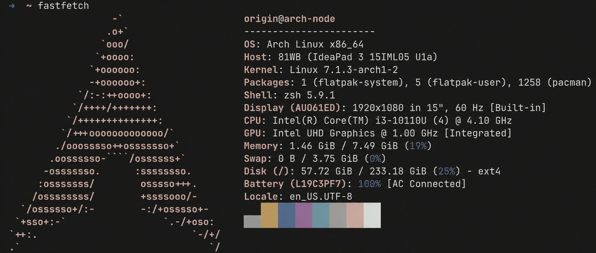
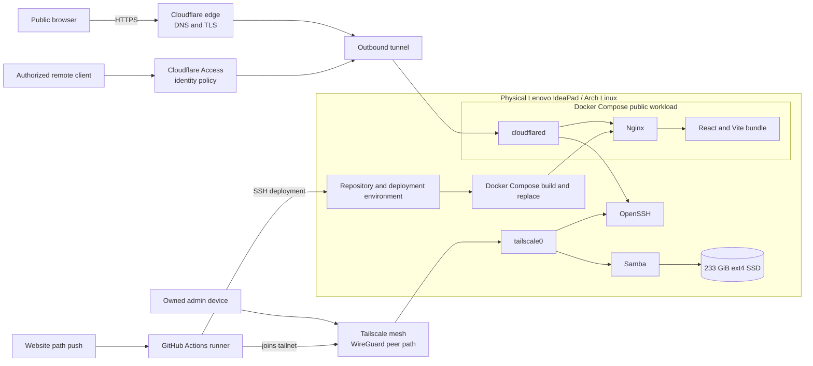

<div align="center">



# arch-server

**A headless Arch Linux node for private storage, remote administration, and zero-port public web delivery on repurposed hardware.**

[](https://archlinux.org/)
[](https://www.docker.com/)
[](https://www.cloudflare.com/)
[](https://tailscale.com/)
[](https://github.com/features/actions)

[Live documentation](https://arch-server.tanmaytiwari.me)

</div>

## What this project is

This project began with an old Lenovo IdeaPad whose display had become unreliable. Instead of retiring it, I converted it into a headless Arch Linux node.

The machine now provides four practical surfaces:

- A public documentation website served from the same physical machine it describes
- Private cross-platform storage through Samba
- Remote administration through OpenSSH over Tailscale
- Identity-gated remote shell access through Cloudflare Access, including browser rendering

The retained Hyprland desktop remains available for local maintenance and recovery. It is not part of the public serving path.

## Architecture



### Trust boundaries

| Plane | Purpose | Path |
|---|---|---|
| Public data plane | Serve this static website | Browser → Cloudflare edge → outbound tunnel → cloudflared → Nginx |
| Private control plane | Administration and storage | Owned device → Tailscale → `tailscale0` → OpenSSH or Samba |
| Deployment plane | Replace the served frontend | Website path change → GitHub Actions → Tailscale → SSH → repository update → Compose rebuild |
| Identity-gated shell | Remote access without joining the tailnet | Authorized client → Cloudflare Access → tunnel route → cloudflared → OpenSSH |

No router port forwarding is required for these paths. Private identifiers, hostnames, share names, and access policies are intentionally omitted from this public repository.

## Public website runtime

The root [`docker-compose.yml`](./docker-compose.yml) owns only the public web workload:

- `arch-server-docs`: an Nginx container serving the compiled React bundle
- `cloudflared`: the outbound Cloudflare Tunnel connector

OpenSSH, Tailscale, Samba, NetworkManager, and the desktop session are host services. They are not Docker services in this repository.

The web container uses a multi-stage Node.js and Nginx build, a memory limit, a CPU limit, `no-new-privileges`, and `restart: unless-stopped`. The tunnel container also uses `no-new-privileges` and `restart: unless-stopped`.

## Deployment

The workflow in [`.github/workflows/deploy.yml`](./.github/workflows/deploy.yml) runs when the website, Compose definition, or deployment workflow changes on `main`. Concurrent runs queue instead of interrupting an active production deployment.

1. GitHub checks out the repository with read-only repository permissions.
2. The runner temporarily joins the private tailnet using a repository secret.
3. The SSH action connects to the node over that private network.
4. The repository is cloned or updated under the server's services directory.
5. The tunnel token is written to a local, ignored environment file.
6. Docker Compose builds the changed image and converges the running workload without an unconditional container teardown.

The workflow pins released action versions rather than moving `master` branches. A future credential migration should replace the current Tailscale auth key with a tagged OAuth or workload-identity flow so each CI runner remains short-lived and narrowly authorized.

## Hardware profile

| Subsystem | Specification |
|---|---|
| Model | Lenovo IdeaPad 3 15IML05 |
| Processor | Intel Core i3-10110U, 4 threads |
| Memory | 8 GiB DDR4 |
| Storage | 233 GiB SSD with ext4 |
| Graphics | Intel UHD Graphics |
| Network | Wi-Fi through NetworkManager plus Tailscale |
| Operating system | Arch Linux x86_64 |

The Fastfetch image above is privacy-sanitized. Volatile utilization values are a historical snapshot, not live telemetry.

## Remote administration

### OpenSSH over Tailscale

Owned devices and the deployment runner use ordinary OpenSSH over the private Tailscale network. Tailscale provides peer discovery, NAT traversal, and WireGuard encryption. Direct peer connectivity is preferred; relays are a fallback when a direct path cannot be established.

### Cloudflare Access

An identity-gated Cloudflare Access application provides a second remote path for authorized clients. The exact hostname, allowed identities, session policy, and origin authentication configuration remain private.

### Browser terminal

Cloudflare browser rendering can expose the same protected shell in a modern browser when the access policy permits it. This provides a no-install recovery path without publishing a direct origin endpoint.

### Giving another person access

Reachability from anywhere does not make the shell public, but credentials must remain personal:

- Do not share the Cloudflare account login. It can change DNS, tunnels, and Access policy.
- Do not share an existing Cloudflare identity session, Tailscale auth key, SSH private key, or account password.
- For browser access, allow the person's own identity in a narrow Cloudflare Access policy with MFA and a short session.
- For ongoing private-network access, invite the person with restricted access controls or share only the required Tailscale machine or service.
- Give each operator a separate SSH key so access can be revoked without rotating another person's credentials.

Cloudflare Access controls who may approach the SSH service. The origin's SSH authentication and authorization still determine what that approved person can do on the machine.

## Samba NAS

Samba provides cross-platform file access reached privately over Tailscale.

| Client | Generic connection form |
|---|---|
| macOS | `smb://<private-node>` |
| Windows | `\\<private-node>` |
| Android | SMB client pointed at `<private-node>` |
| iOS / iPadOS | `smb://<private-node>` |

This repository does not contain the active Samba or firewall configuration, so it documents the intended private access path without claiming an unverified interface binding.

## Headless lifecycle

- Lid-close behavior was configured so the damaged display does not suspend the server.
- Host daemons are managed through systemd.
- The two public containers declare `restart: unless-stopped`.
- After an ordinary reboot, enabled host services and the Compose restart policy restore the intended serving path once networking is available.
- Recovery after a total power loss still depends on the machine receiving power and completing its firmware and operating-system boot sequence.

## Retained desktop and local tools

The local desktop is versioned separately in [hyprland-dotfiles](https://github.com/tanmayhutt/hyprland-dotfiles). It includes Hyprland, Waybar, Kitty, Zsh, Pywal, Wofi, CAVA, Hyprlock, and helper scripts for deployment and power profiles.

Operational tools used on the node include:

- `wlctl` for NetworkManager-oriented wireless administration
- `yazi` for keyboard-first file operations
- KDE Connect for local device transfer
- Small shell scripts for battery, network, media, and session checks

The website uses a privacy-redacted version of the original desktop capture. It masks network names, local addresses, account identifiers, filesystem paths, and unsuitable terminal text while retaining the non-private system state from that session.

## Repository structure

```text
arch-server/
├── .github/workflows/deploy.yml
├── assets/
│   ├── fastfetch-sanitized.jpg
│   └── hyprland-redacted.jpg
├── website/
│   ├── public/
│   ├── src/components/
│   ├── src/pages/
│   ├── Dockerfile
│   └── package.json
├── docker-compose.yml
└── README.md
```

## Local website development

```bash
cd website
npm ci
npm run dev
```

Validation commands:

```bash
npm run lint
npm run build
```

The frontend uses React, Vite, Tailwind CSS, Motion, selected Magic UI interaction patterns, a custom canvas particle globe, and a lossless zoomable SVG topology. JetBrains Mono is served locally with the site instead of loaded from a third-party font request.

## Security notes

- Secrets belong in GitHub Actions secrets or local ignored environment files.
- No access tokens, private keys, internal addresses, SSIDs, usernames, or share paths should be committed.
- Public diagrams describe boundaries and flows, not usable connection details.
- Static interface labels represent documented configuration, not live monitoring.
- The production Nginx response sets a restrictive content policy, framing protection, content-type protection, referrer policy, and disables unused browser permissions.
- Shared access should use separate, revocable identities and keys. Administrator accounts and enrollment secrets are never guest credentials.

## Roadmap

- Home automation and ESP8266 experimentation, intentionally not deployed yet
- Optional verified health reporting if a minimal public-safe signal is introduced
- Host configuration documentation for services that currently live outside this repository
